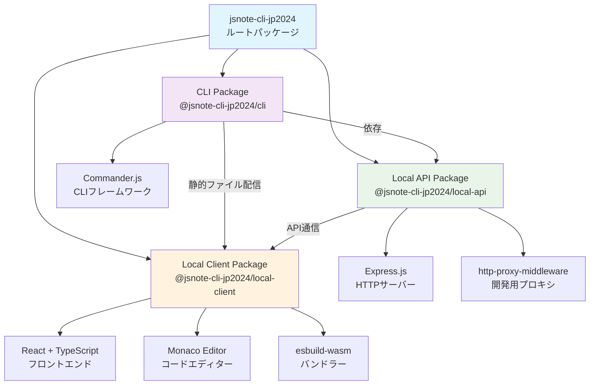
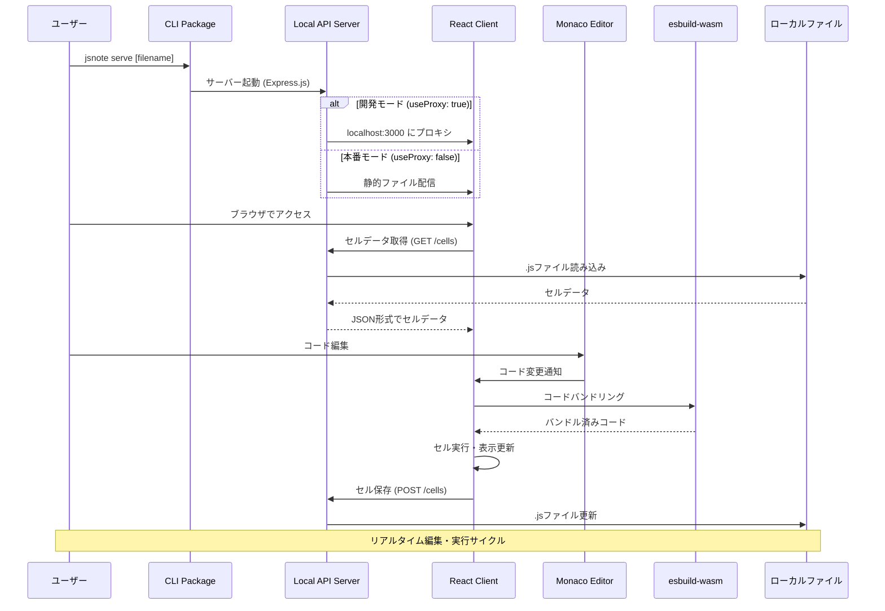
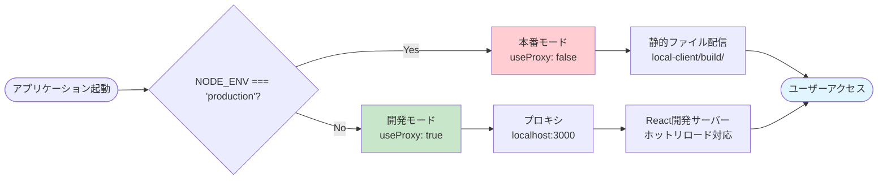

# 概要

## 関連ソースファイル
* **jbook/.gitignore**
* **jbook/package.json**
* **jbook/packages/cli/src/commands/serve.ts**
* **jbook/packages/local-api/src/index.ts**
* **jbook/packages/local-client/src/components/resizable.tsx**

## 目的とスコープ

この文書は、jsnote-cli-jp2024リポジトリの概要を提供します。これは、インタラクティブなJavaScript開発のためのノートブックスタイルのアプリケーションです。このシステムでは、ユーザーがJavaScriptコードまたはマークダウンテキストを含む「セル」を作成・編集できます。Jupyterノートブックに似ていますが、ブラウザでのJavaScript実行に特化して設計されています。

CLIコマンドとオーケストレーションの詳細については、**CLIパッケージ**を参照してください。サーバーサイドのAPI機能については、**ローカルAPIパッケージ**を参照してください。Reactベースのユーザーインターフェースについては、**ローカルクライアントパッケージ**を参照してください。

## アプリケーション機能

jsnote-cli-jp2024アプリケーションにより、開発者は以下のことができます：

* 実行可能なコードセルとテキストセルを含むインタラクティブなJavaScriptノートブックの作成
* 構文ハイライトとIntelliSenseを備えたMonacoエディターを使用したコード編集
* リアルタイムバンドリングのために`esbuild-wasm`を使用したブラウザでの直接的なJavaScriptコード実行
* バージョン管理と共有のためのローカル`.js`ファイルへのノートブックデータの永続化
* ノートブックインターフェース内でのセルのリサイズと並び替え
* 開発モード（ホットリロード付き）と本番モード（静的ファイル）の両方での実行

このシステムは完全にローカルで動作し、コア機能に対して外部サービスやインターネット接続は必要ありません。

## システムアーキテクチャ

以下の図は、モノレポ構造内の主要パッケージとその関係を示しています：

### パッケージの依存関係と通信フロー

**出典：** jbook/packages/cli/src/commands/serve.ts22-27, jbook/packages/local-api/src/index.ts6-13, jbook/package.json1-10

## ランタイムアーキテクチャとデータフロー

以下の図は、アプリケーション実行中のコンポーネント間の相互作用を示しています：

### コンポーネント相互作用フロー

**出典：** jbook/packages/cli/src/commands/serve.ts15-27, jbook/packages/local-api/src/index.ts12-28, jbook/packages/local-client/src/components/resizable.tsx8-57

## 主要技術と機能

| コンポーネント | 技術 | 目的 |
|-------------|------|------|
| パッケージ管理 | Lerna | 共有依存関係を持つモノレポ構造 |
| CLIフレームワーク | Commander.js | `serve`コマンドのコマンドラインインターフェース |
| サーバーフレームワーク | Express.js | APIエンドポイントと静的ファイルのHTTPサーバー |
| プロキシミドルウェア | http-proxy-middleware | localhost:3000への開発モードプロキシ |
| フロントエンドフレームワーク | React + TypeScript | ユーザーインターフェースコンポーネントと状態管理 |
| 状態管理 | Redux | セルとUIのアプリケーション状態 |
| コードエディター | Monaco Editor | 構文ハイライトとIntelliSense |
| コード実行 | esbuild-wasm | クライアントサイドJavaScriptバンドリングと実行 |
| UIレイアウト | react-resizable | リサイズ可能なパネルとコンポーネント |
| HTTPクライアント | Axios | クライアントとサーバー間のAPI通信 |

**出典：** jbook/package.json4-5, jbook/packages/cli/src/commands/serve.ts2, jbook/packages/local-api/src/index.ts1-4

## デュアルモード動作

アプリケーションは`useProxy`パラメータによって決定される2つの動作モードをサポートします：

### 開発モード（`useProxy: true`）

* ホットリロード機能のために`http://localhost:3000`へのリクエストをプロキシ
* Create React App開発サーバーでのライブ開発を有効化
* `NODE_ENV !== "production"`の場合に有効化

### 本番モード（`useProxy: false`）

* `@jsnote-cli-jp2024/local-client/build/`からの事前ビルド済み静的ファイルを提供
* デプロイメントと配布のために最適化
* `NODE_ENV === "production"`の場合のデフォルトモード

**出典：** jbook/packages/cli/src/commands/serve.ts5-26, jbook/packages/local-api/src/index.ts15-28
